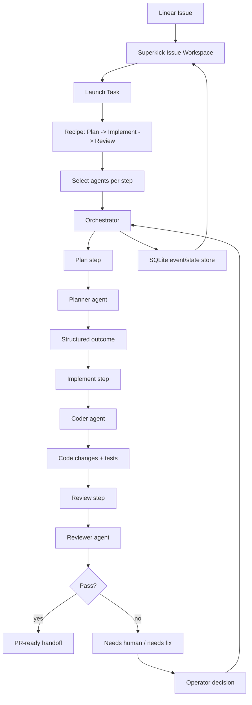
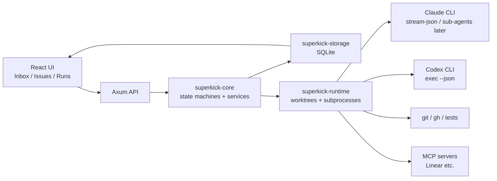

# Superkick expliqué visuellement

Status: learning guide.

Ce document n’est pas une spec d’implémentation. C’est un support visuel pour
comprendre comment Superkick fonctionne, ce qu’est le **harness**, et où se
situe notre valeur produit.

## 0. La phrase simple

Superkick transforme une issue Linear en **Launch Task** autonome, choisit les
agents, les lance dans des **worktrees** isolés, enregistre ce qui s’est passé,
et demande l’humain uniquement quand une décision est nécessaire.

```text
Linear issue
  -> Launch Task
    -> agents
      -> local worktree
        -> protocol events
          -> issue workspace
            -> human arbitration si besoin
```

## 1. Le mental model

Superkick, c’est un **mission control** pour agents.

```text
┌────────────────────────────────────────────────────────────┐
│ Linear                                                     │
│ backlog, issue title, description, comments, labels         │
└───────────────────────┬────────────────────────────────────┘
                        │
                        v
┌────────────────────────────────────────────────────────────┐
│ Superkick                                                  │
│ décide quoi lancer, track l’état, montre le progrès         │
└───────────────────────┬────────────────────────────────────┘
                        │
                        v
┌────────────────────────────────────────────────────────────┐
│ Local machine                                               │
│ git worktree, Claude/Codex CLI, tools, tests, PR commands   │
└────────────────────────────────────────────────────────────┘
```

La séparation importante :

```text
Linear = quoi faire
Superkick = comment exécuter et superviser
Claude/Codex = workers qui font une partie du travail
Git/GitHub/tests = tools qui prouvent que le travail est réel
```

## 2. Ce que Superkick n’est pas

```text
Pas juste un chat app
Pas juste un terminal wrapper
Pas juste Linear avec des boutons
Pas juste Claude Code dans un browser
Pas juste de la CI
```

Superkick est la couche qui connecte tout ça.

```text
Issue context + agent execution + local tools + durable state + human control
```

## 3. L’objet produit principal: Launch Task

L’objet principal n’est pas le chat.

L’objet principal n’est pas le terminal.

L’objet principal est le **Launch Task**.

```text
Launch Task = une tentative autonome de compléter une issue.
```

Workflow V1 :

```text
┌────────────┐     ┌──────────────┐     ┌────────────┐
│   Plan     │ --> │  Implement   │ --> │   Review   │
└────────────┘     └──────────────┘     └────────────┘
      │                   │                   │
      v                   v                   v
 planner agent       coder agent        reviewer agent
```

Si tout marche :

```text
Issue -> Launch Task -> Plan -> Code -> Review -> PR-ready handoff
```

Si ça bloque :

```text
Issue -> Launch Task -> needs human -> operator décide -> continue
```

## 4. L’orchestrator

L’**orchestrator** est le chef d’orchestre.

Il ne fait pas tout le travail lui-même. Il coordonne les agents.

```text
┌──────────────────────────────────────────────────────┐
│ Orchestrator                                         │
├──────────────────────────────────────────────────────┤
│ 1. Lit le contexte de l’issue                         │
│ 2. Crée le Launch Task                                │
│ 3. Choisit le prochain step                           │
│ 4. Lance l’agent sélectionné                          │
│ 5. Observe le résultat                                │
│ 6. Passe au step suivant ou demande l’humain          │
└──────────────────────────────────────────────────────┘
```

Flow cible :

```text
┌──────────────┐
│ Launch Task  │
└──────┬───────┘
       │
       v
┌──────────────┐       success       ┌──────────────┐
│ Plan step    │ ------------------> │ Code step    │
└──────┬───────┘                     └──────┬───────┘
       │ failure / unclear                  │ success
       v                                    v
┌──────────────┐                     ┌──────────────┐
│ Needs human  │                     │ Review step  │
└──────────────┘                     └──────┬───────┘
                                            │
                                      pass  │  fail
                                            v
                                  ┌──────────────────┐
                                  │ Ready / needs fix │
                                  └──────────────────┘
```

## 5. C’est quoi le harness ?

Le **harness** est la couche de contrôle autour d’un agent.

Un agent seul, c’est juste un process CLI comme `claude` ou `codex`.

Le harness lui donne :

```text
context
permissions
worktree
process supervision
event parsing
storage
UI visibility
takeover controls
```

Sans harness :

```text
Tu lances Claude dans un terminal.
Claude fait des choses.
Si ça échoue, tu scrolles les logs et tu devines.
```

Avec harness :

```text
Superkick lance Claude/Codex avec un rôle connu.
Superkick enregistre l’état.
Superkick parse les protocol events.
Superkick affiche le progrès dans l’issue.
Superkick peut cancel, retry, inspect, ou takeover.
```

Visual :

```text
             ┌─────────────────────┐
             │ Agent process        │
             │ claude / codex       │
             └──────────┬──────────┘
                        │
                        v
┌────────────────────────────────────────────────────┐
│ Superkick harness                                  │
├────────────────────────────────────────────────────┤
│ worktree | prompt/context | permissions | MCP       │
│ process supervision | protocol parser | event log   │
│ cancellation | terminal takeover | UI state         │
└────────────────────────────────────────────────────┘
```

Version courte :

```text
Agent = worker
Harness = safety cage + black box recorder + remote control
```

## 6. Les couches principales

```text
┌──────────────────────────────────────────────────────────┐
│ UI                                                       │
│ Inbox, Issues, Runs, Launch Task feed, chat drawer        │
└──────────────────────────┬───────────────────────────────┘
                           │ HTTP / SSE / WebSocket
┌──────────────────────────▼───────────────────────────────┐
│ API                                                      │
│ routes, request/response glue                            │
└──────────────────────────┬───────────────────────────────┘
                           │ appelle les services
┌──────────────────────────▼───────────────────────────────┐
│ Core                                                     │
│ domain state machines: runs, agents, Launch Tasks         │
└──────────────────────────┬───────────────────────────────┘
                           │ persist / execute
       ┌───────────────────┴────────────────────┐
       v                                        v
┌──────────────┐                         ┌──────────────┐
│ Storage      │                         │ Runtime      │
│ SQLite       │                         │ worktrees    │
│ durable truth│                         │ subprocesses │
└──────────────┘                         └──────┬───────┘
                                                │
                                                v
                                      ┌──────────────────┐
                                      │ External tools    │
                                      │ Linear, git, gh,  │
                                      │ Claude, Codex, MCP│
                                      └──────────────────┘
```

Mapping des crates :

```text
superkick-core         = règles produit
superkick-storage      = database durable
superkick-runtime      = worktrees + processes + agents
superkick-integrations = Linear / GitHub adapters
superkick-api          = HTTP server
ui                     = browser control center
```

## 7. De A à Z: lancer une feature

### Step 1: l’issue existe dans Linear

```text
SUP-123
"Add billing settings page"
description, comments, labels, links
```

Superkick lit le contexte.

```text
Linear API / MCP / snapshot
  -> issue title
  -> description
  -> comments
  -> labels
  -> linked issues
```

### Step 2: l’operator lance un Launch Task

```text
Launch Task
recipe: Plan -> Implement -> Review

Plan agent:      planner
Implement agent: coder
Review agent:    reviewer
```

### Step 3: Superkick crée le workspace local

```text
main repo
  -> .worktrees/sup-123-launch-task
      -> branch
      -> isolated files
```

Pourquoi c’est important :

```text
L’agent peut edit sans salir main.
Plusieurs tasks peuvent tourner en parallèle.
La review peut inspecter le diff exact.
```

### Step 4: l’orchestrator lance le plan step

```text
LaunchTaskStep(plan)
  -> selected AgentDefinition(planner)
    -> RoleRouter resolve provider/model/prompt/policy
      -> Runtime starts provider
```

Provider possible :

```text
Claude protocol backend
Codex protocol backend
PTY-backed CLI
future provider
```

### Step 5: l’agent utilise des tools

L’agent peut appeler :

```text
Read files
Search code
Edit files
Run tests
Run git
Call MCP servers if allowed
Open PR through gh
```

Mais Superkick décide ce qu’il a le droit de voir/utiliser.

```text
AgentDefinition
  -> provider
  -> tools policy
  -> MCP policy
  -> model
  -> role instructions
```

### Step 6: Superkick enregistre l’evidence

Mauvais produit :

```text
"Trust me, the agent worked."
```

Produit Superkick :

```text
Plan created
Files edited
Tests ran
Review completed
PR opened
Human decision needed
```

L’evidence devient de l’UI :

```text
┌─────────────────────────────────────┐
│ Launch Task                         │
├─────────────────────────────────────┤
│ ✓ Plan        planner   completed   │
│ ● Implement   coder     running     │
│ ○ Review      reviewer  pending     │
└─────────────────────────────────────┘
```

### Step 7: l’humain intervient seulement si besoin

```text
Needs human:
  "Reviewer found unsafe migration. Approve schema change?"

Actions:
  approve
  reject
  open chat
  inspect terminal
  cancel
  retry step
```

## 8. Protocol-first vs terminal

Il y a deux manières de lancer un agent.

### Ancien mental model: terminal-first

```text
Browser terminal -> PTY -> Claude/Codex CLI
```

Avantages :

```text
Ça paraît réel.
L’operator peut taper.
C’est facile à comprendre.
```

Limites :

```text
Difficile à parser.
Principalement des text logs.
Difficile de construire une bonne product UI.
```

### Nouveau target: protocol-first

```text
Superkick -> Claude/Codex JSON stream -> protocol events -> UI
```

Avantages :

```text
On sait ce qui s’est passé.
On peut render actions, tool calls, tests, failures.
On peut persist les events proprement.
On peut construire de l’orchestration.
```

Limite :

```text
Ce n’est pas un vrai live terminal mid-turn.
Le takeover doit rester honnête.
```

### Le modèle final

```text
Protocol-first pour l’exécution normale.
Terminal takeover comme escape hatch.
```

```text
Normal:
Issue -> Launch Task -> protocol events -> feed

Si besoin:
Issue -> Run -> inspect / continue / force takeover terminal
```

## 9. Chat, terminal, feed

Ce sont trois surfaces différentes.

```text
Execution feed = ce qui se passe
Chat           = intervenir ou discuter
Terminal       = inspect / takeover
```

Bonne hiérarchie :

```text
┌────────────────────────────────────────────┐
│ Issue workspace                            │
├────────────────────────────────────────────┤
│ Launch Task feed        PRIMARY            │
│ Chat drawer             SUPPORT            │
│ Terminal takeover       FALLBACK            │
└────────────────────────────────────────────┘
```

Mauvaise hiérarchie :

```text
Chat comme produit entier
Terminal comme produit entier
Raw logs comme produit entier
```

## 10. AgentDefinition

Un `AgentDefinition`, ce n’est pas juste “Claude”.

C’est un rôle configuré.

```yaml
planner:
  provider: claude
  model: sonnet
  role: plan
  system_prompt: "Create a concise implementation plan."
  mcp:
    mode: servers
    servers: [linear]
```

V1 :

```text
planner
coder
reviewer
```

P2 :

```text
repo-ticket-triage
security-reviewer
test-runner
migration-expert
design-reviewer
```

Important :

```text
Step kind = ce qui doit être fait
AgentDefinition = qui/comment le faire
Provider = quel moteur l’exécute
```

Visual :

```text
Step: Review
  -> Agent: pre-pr-reviewer
    -> Provider: Claude
      -> Backend: Claude skill / protocol / sub-agent
```

## 11. Provider agnostic, provider optimized

Superkick ne doit pas devenir Claude-only.

Contrat core :

```text
run_step(agent, context) -> events + outcome
```

Implémentations provider-specific :

```text
Claude:
  - stream-json
  - skills
  - sub-agents later

Codex:
  - exec --json
  - resume key
  - prompt-specialized roles

Future:
  - other CLIs
  - local models
  - hosted agents
```

Le produit garde une abstraction :

```text
Agent execution backend
```

L’utilisateur voit :

```text
Planner agent
Coder agent
Reviewer agent
```

Pas :

```text
random CLI flags and process details
```

## 12. MCP et tools

MCP est une manière contrôlée de donner à l’agent accès à des tools/data
externes.

Exemple :

```text
Linear MCP
  -> lire issue details
  -> fetch comments
  -> accéder aux attachments si disponible
```

Policy Superkick :

```text
No MCP by default.
Chaque rôle opt-in.
Chaque spawn record ce qui était autorisé.
```

Visual :

```text
AgentDefinition(planner)
  -> allowed MCP: linear
  -> allowed tools: read, grep
  -> denied tools: dangerous actions
```

Pourquoi c’est important :

```text
Le planner peut avoir besoin du contexte Linear.
Le reviewer n’a pas forcément besoin de write access.
Le coder peut avoir besoin de shell/tests.
Chaque step a besoin de pouvoirs différents.
```

## 13. Durable state

La database est le **black box recorder**.

```text
SQLite stores:
  runs
  run events
  agent sessions
  conversations
  turns
  protocol events
  orchestrator sessions
  launch tasks
  launch task steps
```

Pourquoi c’est crucial :

```text
refresh page -> on sait toujours ce qui s’est passé
restart app -> on peut recover l’état
failed run -> on inspecte la cause
review -> on voit l’evidence
future orchestrator -> reprend depuis checkpoint
```

Sans durable state :

```text
Agent logs disparaissent.
UI devine.
Orchestration impossible à trust.
```

## 14. La value chain

La plupart des tools possèdent une seule pièce.

```text
Linear        = issue tracking
Claude Code   = local coding agent
Codex         = local coding agent
Cursor        = IDE chat
CI            = test execution
GitHub        = PR/review system
```

Superkick connecte la chaîne.

```text
Issue
  -> selected workflow
    -> selected agents
      -> local execution
        -> evidence
          -> human arbitration
            -> PR-ready output
```

C’est ça notre moat.

## 15. Ce qui différencie Superkick

```text
1. Issue-first
   On part du vrai travail Linear, pas d’un chat vide.

2. Local-first
   Ça tourne sur la machine de l’utilisateur avec ses comptes/tools.

3. Agent orchestration
   On coordonne planner/coder/reviewer au lieu d’un bot opaque.

4. Durable execution state
   On stocke ce qui s’est passé, pas juste la prose finale.

5. Human control
   L’operator arbitre les blockers et peut takeover.

6. Provider agnostic
   Claude/Codex sont des backends, pas le produit.

7. Terminal as escape hatch
   On garde la puissance du CLI sans faire des logs l’UI principale.
```

## 16. Le flux end-to-end



## 17. Le schéma architecture



## 18. Comment l’expliquer en 60 secondes

Superkick prend une issue Linear et la transforme en mission locale
supervisée. Au lieu de demander à un seul chat AI de “faire le truc”,
Superkick crée un Launch Task avec des steps comme Plan, Implement et Review.
Chaque step peut utiliser un agent différent. Les agents tournent localement
dans des git worktrees isolés via Claude, Codex ou un autre backend. Superkick
record l’evidence, montre le progrès dans l’issue, et demande l’humain
seulement quand une décision est nécessaire. Le terminal et le chat restent
disponibles, mais ce sont des support tools, pas le cœur du produit.

## 19. Ce qu’on construit maintenant

```text
SUP-116
  Launch Task model

SUP-117
  Launcher UI with per-step agent selection

SUP-118
  Execution loop: Plan -> Implement -> Review

SUP-119
  Launch Task feed on issue workspace

SUP-120
  Retry / cancel / human intervention controls

SUP-121
  Optional Claude sub-agent / skill backend
```

Résultat V1 :

```text
One issue
  -> one Launch Task
    -> selected agents
      -> autonomous Plan -> Code -> Review
        -> visible progress
          -> human intervention if needed
```

Résultat P2 :

```text
One feature
  -> multiple linked issues
    -> orchestrator assigns agents
      -> agents run in parallel when safe
        -> dependency-aware unblock flow
          -> PR-ready work streams
```

